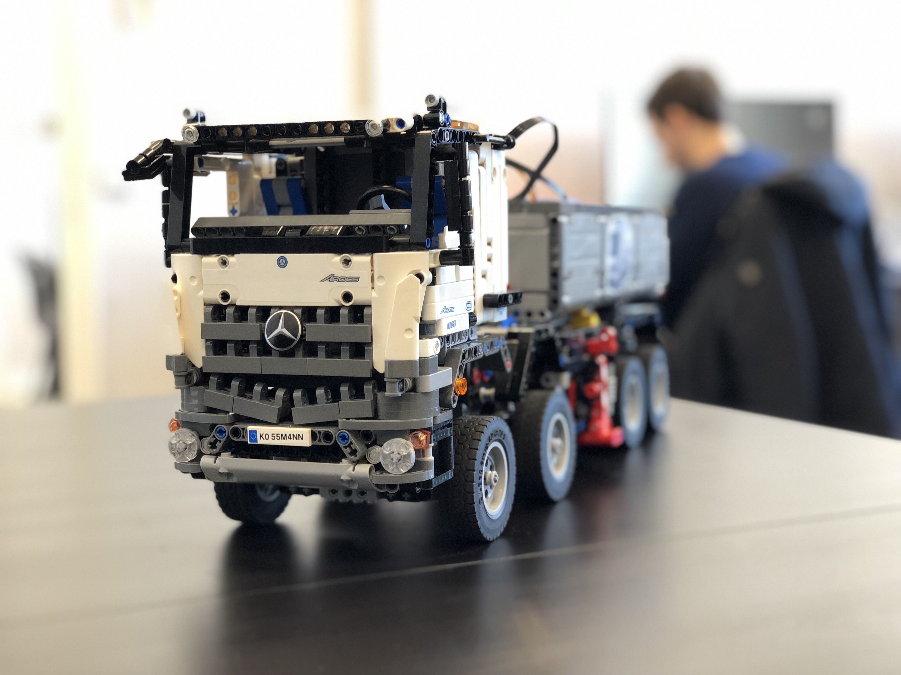

# Code challenges

Publicly sourced code-challenges for tb.lx!

Find more on [tb.lx website](https://tblx.io/)

### Roles
* Backend Developer [link](backend-dev-challenges/readme.md)
* Data Engineer [link](data-engineer-challenges/README.md)
* Data Scientist [link](data-scientist-challenges/readme.md)
* Frontend Developer [link](frontend-dev-challenges/readme.md)
* Fullstack Developer [link](fullstack-challenges/readme.md)

### License
This project is licensed under the terms of the MIT license. See [LICENSE](LICENSE)
